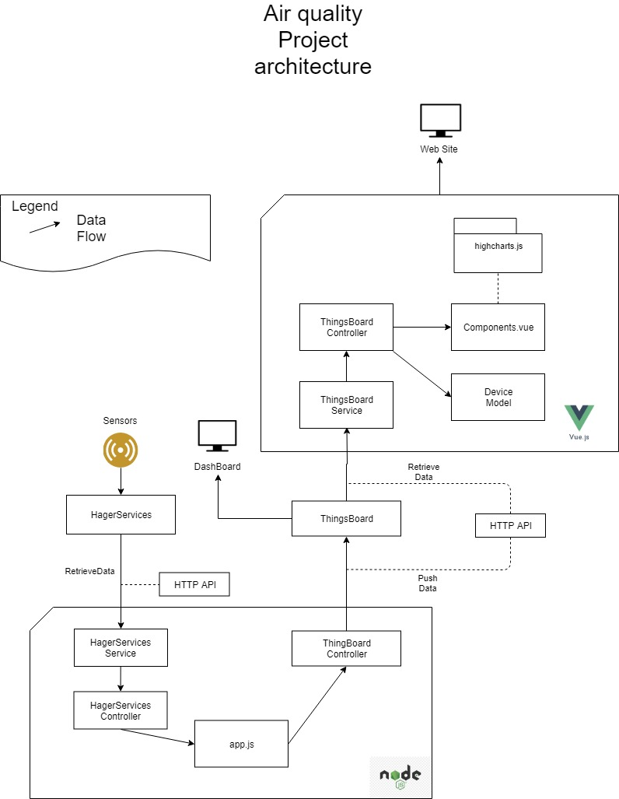

# Dashboard

It is used to monitor the air quality of the Nimbus building.

## Description
**Language :** JavaScript (Vuejs)
**Dependencies :** npm + [package.json](package.json)
 
## Data Structure
You can find below the architecture of the project in the top right corner of this diagram. 

The Program is divided in 4 parts: Model, Service, Controller and Components.

### Service

The service retrieves data from local Thingsboard API. The folder `src/service/thingsboard` regroups 3 files:

##### [thingsBoardService.js](src/service/thingsboardService.js)
A collection of the function returning the different raw data from the api using the custom axios service. 

##### [http.js](src/service/http.js)
A custom axios service to call the Thingsboard API.

Every route (except for the login) requires a JWT token (please refer to the official documentation).

The method refreshAuthLogic id used to refresh the token each time the API response is a HTTP code 401.
That way, the token is refreshed only when needed.  

##### [routes.jon](src/service/routes.json)
A json file where the routes to the Thingsboard API.

### Controller
Used to call the service and process some logic. used in the components

### Components
The Vue components are divided in 3 parts and a main component.

#### The [Main.vue](src/components/Main.vue) component
 
 All the components in the main component use the devices of the main component.
 That way if the devices are edited, all the views of the components will be updated.
 
 #### The other components
 
The other components mainly use the device props to process and then display what they are made for.

**The filters** emit an event on submit to the main component containing the new selected device to load.

**the CSS** rules are defined in each component as a scoped stylesheet.

### [Config.json](src/config.json)

This file contains a lot of information: the credentials to connect to thingsboard and all the information regarding the
 sensors on thingsBoard.
To create a new sensor type, it is possible to copy the default cricket sensor. 

In it you can find the **status** object
 where for each timeseries, the min, max and limits value are defined.
They are used to change the desirable range where you consider the values correct.